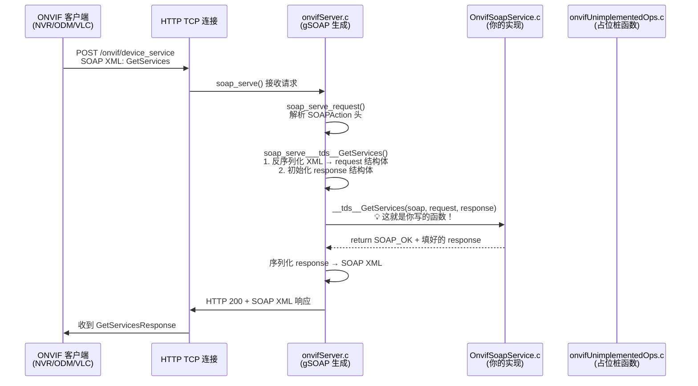

# gSOAP 在你项目中的完整工作机制

## 一句话总结

**gSOAP 是一个"代码生成框架"**：它读 WSDL（ONVIF 规范），生成一堆 C 代码（序列化/反序列化 + 路由分发），然后**要求你实现特定签名的 C 函数**作为业务逻辑。你的 `OnvifSoapService.c` 就是填这些"坑"的地方。

---

## 完整调用链（以 GetServices 为例）



## 三层文件结构

```
┌─────────────────────────────────────────────────────────────┐
│                    你的业务代码 (手写)                        │
│                                                             │
│  OnvifSoapService.c     ← 实现了你关心的操作               │
│  ├─ __tds__GetDeviceInformation    (Device 服务, 6个)       │
│  ├─ __tds__GetSystemDateAndTime                             │
│  ├─ __tds__GetScopes                                       │
│  ├─ __tds__GetServiceCapabilities                           │
│  ├─ __tds__GetServices                                     │
│  ├─ __tds__GetCapabilities                                 │
│  ├─ __trt__GetServiceCapabilities  (Media v1 服务, 4个)     │
│  ├─ __trt__GetProfiles                                     │
│  ├─ __trt__GetProfile                                      │
│  ├─ __trt__GetStreamUri                                    │
│  ├─ __tr2__GetServiceCapabilities  (Media v2 服务, 3个)     │
│  ├─ __tr2__GetProfiles                                     │
│  └─ __tr2__GetStreamUri                                    │
│                                                             │
│  + WS-Discovery 服务端回调 (wsdd_event_Probe 等)            │
│  + 两个主循环函数                                           │
├─────────────────────────────────────────────────────────────┤
│                   占位桩函数 (手写/生成)                     │
│                                                             │
│  onvifUnimplementedOps.c  ← ~230个 return SOAP_NO_METHOD   │
│  所有你"不需要实现"的 ONVIF 操作都在这里                    │
│  客户端调了会返回 SOAP Fault (方法不支持)                    │
├─────────────────────────────────────────────────────────────┤
│              gSOAP 自动生成代码 (不要手动修改!)              │
│                                                             │
│  onvifServer.c (10806行!)                                   │
│  ├─ soap_serve()           → HTTP 主循环入口               │
│  ├─ soap_serve_request()   → 解析 SOAPAction, switch 路由  │
│  │   有 248 个 case！每个 ONVIF 操作一个 case              │
│  └─ soap_serve___tds__GetServices()  → 反序列化 + 调你的函数│
│                                        + 序列化响应         │
│  onvifC.c       → XML 序列化/反序列化代码                   │
│  onvifClient.c  → 客户端调用桩 (你做服务端不用管)           │
│  onvifH.h       → 所有 struct 定义                         │
│  onvifStub.h    → 函数声明                                 │
└─────────────────────────────────────────────────────────────┘
```

## 核心机理：函数名就是"路由"

gSOAP 的路由机制极其简单粗暴：

1. `onvifServer.c` 里的 `soap_serve_request()` 看 HTTP 请求里的 SOAPAction 头
2. 根据 SOAPAction 找到对应的 `soap_serve___tds__GetServices()`
3. 这个生成函数做完 XML 反序列化后，调用 `__tds__GetServices()` — **这是一个全局 C 函数名**
4. **链接器**负责把这个符号绑定到你在 `OnvifSoapService.c` 里写的实现

> [!IMPORTANT]
> **函数签名是固定的！** 函数名、参数类型由 WSDL 决定，gSOAP 生成好了。你只需要"填空"函数体。

## 如何添加一个新的 ONVIF 操作？

比如你想实现 `GetNetworkInterfaces`：

### 步骤 1：找到占位函数
在 [onvifUnimplementedOps.c](file:///home/hjy/nfs/MultiCamRenderer/generated/onvif/device/onvifUnimplementedOps.c#L48) 里找到：
```c
int __tds__GetNetworkInterfaces() { return SOAP_NO_METHOD; }
```

### 步骤 2：删掉占位函数
把这一行从 `onvifUnimplementedOps.c` 里**删除**（否则链接器会报重复定义）

### 步骤 3：在 OnvifSoapService.c 里写实现
去 [onvifStub.h](file:///home/hjy/nfs/MultiCamRenderer/generated/onvif/device/onvifStub.h) 或 [onvifH.h](file:///home/hjy/nfs/MultiCamRenderer/generated/onvif/device/onvifH.h) 里搜 `GetNetworkInterfaces` 找到正确的函数签名，然后在 `OnvifSoapService.c` 里实现：

```c
int __tds__GetNetworkInterfaces(struct soap *soap,
                                 struct _tds__GetNetworkInterfaces *request,
                                 struct _tds__GetNetworkInterfacesResponse *response)
{
    // 你的实现...
    // 通过 service_config(soap) 获取配置
    // 用 soap_calloc() 分配内存
    // 填充 response 的字段
    return SOAP_OK;
}
```

### 就这三步，不需要改 onvifServer.c！

路由已经被 gSOAP 自动生成了（那 248 个 switch case），你只要把桩函数替换成真实实现就行。

## 你目前已实现的操作统计

| 服务 | 前缀 | 已实现 | 总数(WSDL) |
|---|---|---|---|
| Device | `__tds__` | 6个 | ~97个 |
| Media v1 | `__trt__` | 4个 | ~75个 |
| Media v2 | `__tr2__` | 3个 | ~56个 |
| WS-Discovery | `wsdd_event_*` | 6个回调 | 6个(全部) |

> [!TIP]
> 作为一个 IPC 摄像头，你目前实现的这些操作已经足够让 ONVIF 客户端**发现设备、查询信息、获取 RTSP 流地址**了。这是最小可用集。

## soap->user 的技巧

你的代码用了一个巧妙的方式传递配置：
```c
soap.user = (void *)config;  // 启动时设置

// 每个操作函数里取出来：
const OnvifSoapServiceConfig *config = service_config(soap);
// 等价于: (const OnvifSoapServiceConfig *)soap->user
```
这是 gSOAP 预留的"用户数据指针"，因为生成的调度代码不允许你加自定义参数。
